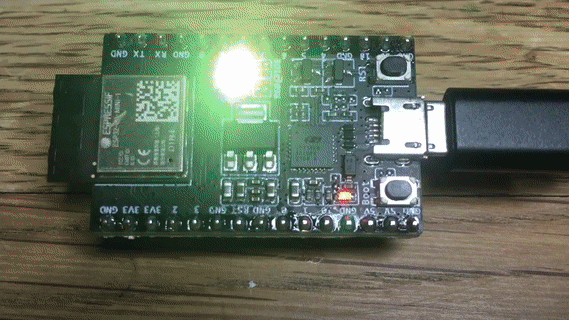

# MDK (Minimal Development Kit) - a baremetal ESP32/ESP32C3 SDK

An bare metal, make-based SDK for the ESP32, ESP32C3 chips.
It is written from scratch using datasheets (
[ESP32 C3 TRM](https://www.espressif.com/sites/default/files/documentation/esp32-c3_technical_reference_manual_en.pdf),
[ESP32 TRM](https://www.espressif.com/sites/default/files/documentation/esp32_technical_reference_manual_en.pdf)
).
It is completely independent from the ESP-IDF and does not use any
ESP-IDF tools or files. The only tool required is a GCC crosscompiler.

A screenshot below demonstrates a [examples/c3ws2812](examples/c3ws2812)
RGB LED firmware flashed on a ESP32-C3-DevKitM-1 board. It takes < 2 seconds
for a full firmware rebuild and flash:



# Environment setup

Install a GCC RISCV compiler and export environment variables:
- MacOS (installation takes time):
  ```sh
  $ brew tap riscv/riscv
  $ brew install riscv-gnu-toolchain --with-multilib
  $ export MDK=/path/to/mdk                 # Points to MDK directory
  $ export PATH=$PATH:$MDK/tools            # Add $MDK/tools to $PATH
  $ export TOOLCHAIN=riscv64-unknown-elf    # $TOOLCHAIN-gcc must run GCC
  $ export ARCH=ESP32C3                     # Choices: ESP32C3, ESP32
  $ export PORT=/dev/cu.usb*                # Serial port for flashing
  ```
- Linux: install GCC, e.g. from https://github.com/espressif/crosstool-NG, then
  ```sh
  $ export MDK=/path/to/mdk                 # Points to MDK directory
  $ export PATH=$PATH:$MDK/tools            # Add $MDK/tools to $PATH
  $ export TOOLCHAIN=riscv32-esp-elf        # $TOOLCHAIN-gcc must run GCC
  $ export ARCH=ESP32C3                     # Choices: ESP32C3, ESP32
  $ export PORT=/dev/ttyUSB0                # Serial port for flashing
  ```

Verify setup by building and flashing a blinky example firmware.
From repository root, execute:

```sh
$ make -C examples/blinky clean build flash monitor
```

# Firmware Makefile

Firmware Makefile should look like this:

```make
SOURCES = main.c another_file.c

EXTRA_CFLAGS ?=
EXTRA_LINKFLAGS ?=

include $(MDK)/make/build.mk
```

# Environment reference

Environment / Makefile variables:

| Name | Description |
| ---- | ----------- |
| ARCH | Architecture. Possible values: ESP32C3, ESP32. Default: ESP32C3 |
| TOOLCHAIN | GCC binary prefix. Default: riscv64-unknown-elf |
| PORT | Serial port. Default: /dev/ttyUSB0 |
| FPARAMS | Flash parameters, see below. Default: 0x21f |
| EXTRA\_CFLAGS | Extra compiler flags. Default: empty |
| EXTRA\_LINKFLAGS | Extra linker flags. Default: empty |

Makefile targets:

| Name | Description | 
| ---- | ----------- |
| clean | Clean up build artifacts |
| build | Build firmware in a project's `build/` directory |
| flash | Flash firmware. Needs PORT variable set |
| monitor | Run serial monitor. Needs PORT variable set |
| unix | Build Mac/Linux executable firmware, see "UNIX mode" section below |


Preprocessor definitions

| Name | Description | 
| ---- | ----------- |
| LED1 | User LED pin. Default: 2 |
| BTN1 | User button pin. Default: 9 |


# API reference

API support matrix:

| Name    | GPIO | SPI | I2C | UART | WiFi | Timer | System | RTOS |
| ----    | ---- | --- | --- | ---- | ---- | ----- | ------ | ---- |
| ESP32C3 | yes  | yes |  -  |  yes |  -   |  yes  |  yes   | -    |
| ESP32   | yes  | yes |  -  |  -   |  -   |  yes  |  yes   | -    |

- GPIO [src/gpio.h](src/gpio.h)
  ```c
  void gpio_output(int pin);              // Set pin mode to OUTPUT
  void gpio_input(int pin);               // Set pin mode to INPUT
  void gpio_write(int pin, bool value);   // Set pin to low (false) or high
  void gpio_toggle(int pin);              // Toggle pin value
  bool gpio_read(int pin);                // Read pin value
  ```
- SPI [src/spi.h](src/spi.h), [src/spi.c](src/spi.c)
  ```c
  // SPI descriptor. Specifies pins for MISO, MOSI, CLK and chip select
  struct spi { int miso, mosi, clk, cs[3]; };

  bool spi_init(struct spi *spi);           // Init SPI
  void spi_begin(struct spi *spi, int cs);  // Start SPI transaction
  void spi_end(struct spi *spi, int cs);    // End SPI transaction
  unsigned char spi_txn(struct spi *spi, unsigned char);   // Do SPI transaction
  ```
- UART [src/uart.h](src/uart.h), [src/uart.c](src/uart.c)
  ```c
  void uart_init(int no, int tx, int rx, int baud);   // Initialise UART
  bool uart_read(int no, uint8_t *c);   // Read byte. Return true on success
  void uart_write(int no, uint8_t c);   // Write byte. Block if FIFO is full
  ```
- LEDC
- WDT [src/wdt.h](src/wdt.h)
  ```c
  void wdt_disable(void);   // Disable watchdog
  ```
- Timer [src/timer.h](src/timer.h)
  ```c
  struct timer {
    uint64_t period;       // Timer period in micros
    uint64_t expire;       // Expiration timestamp in micros
    void (*fn)(void *);    // Function to call
    void *arg;             // Function argument
    struct timer *next;    // Linkage
  };

  #define TIMER_ADD(head_, p_, fn_, arg_)
  void timers_poll(struct timer *head, uint64_t now);
  ```
- System  [src/sys.h](src/sys.h)
  ```c
  int sdk_ram_used(void);           // Return used RAM in bytes
  int sdk_ram_free(void);           // Return free RAM in bytes
  unsigned long time_us(void);      // Return uptime in microseconds
  void delay_us(unsigned long us);  // Block for "us" microseconds
  void delay_ms(unsigned long ms);  // Block for "ms" milliseconds
  void spin(unsigned long count);   // Execute "count" no-op instructions
  ```
- Log [src/log.h](src/log.h), [src/log.c](src/log.c)
  ```c
  void sdk_log(const char *fmt, ...);   // Log message to UART 0
                                        // Supported specifiers:
                                        // %d, %x, %s, %p
  void sdk_hexdump(const void *buf, size_t len);  // Hexdump buffer
  ```
- TCP/IP


# UNIX mode

Firmware examples could be built on Mac/Linux as normal UNIX binaries.
In the firmware directory, type

```sh
make unix
```

That builds a `build/firmware` executable.
To support that, all hardware API are mocked out. The typical API
implementation looks like:

```c
#if defined(ESP32C3)
...
#elif defined(ESP32)
...
#elif defined(__unix) || defined(__unix__) || defined(__APPLE__)
...  <-- Here goes a mocked-out hardware API implementation
#endif
```

# ESP32 flashing

Flashing ESP32 chips is done via UART. In order to do so, ESP32 should be
rebooted in the flashing mode, by pulling IO0 low during boot. Then, a ROM
bootloader uses SLIP framing for a simple serial protocol, which is
described at https://github.com/espressif/esptool/wiki/Serial-Protocol.

Using that SLIP protocol, it is possible to write images to flash at
any offset. That is what [tools/esputil.c](tools/esputil.c) implements.
The image should be of the following format:

- COMMON HEADER - 4 bytes, contains number of segments in the image and flash params
- ENTRY POINT ADDRESS - 4 bytes, the beginning of the image code
- EXTENDED HEADER - 16 bytes, contains chip ID and extra flash params
- One or more SEGMENTS, which are padded to 16 bytes

```
 | COMMON HEADER |  ENTRY  |           EXTENDED HEADER          | SEGM1 | ... | 
 | 0xe9 N F1 F2  | X X X X | 0xee 0 0 0 C 0 V 0 0 0 0 0 0 0 0 1 |       | ... | 

   0xe9 - Espressif image magic number. All images must start with 0xe9
   N    - a number of segments in the image
   FP1  - flash mode. 0: QIO, 1: QOUT, 2: DIO, 3: DOUT
   FP2  - flash size (high 4 bits) and flash frequency (low 4 bits):
            size: 0: 1MB, 0x10: 2MB, 0x20: 4MB, 0x30: 8MB, 0x40: 16MB
            freq: 0: 40m, 1: 26m, 2: 20m, 0xf: 80m

   ENTRY - 4-byte entry point address in little endian
   C     - Chip ID. 0: ESP32, 5: ESP32C3
   V     - Chip revision
```

By default, `esputil` uses flash params `0x21f`, which means 4MB chip,
80 MHz frequency. In order to set a different value, use
`-fp 0x..`  argument, or `FPARAMS=0x...` make variable.
These two commands are equivalent:

```
$ make flash FPARAMS=0x21f
$ esputil -fp 0x21f flash build/firmware.bin
```
